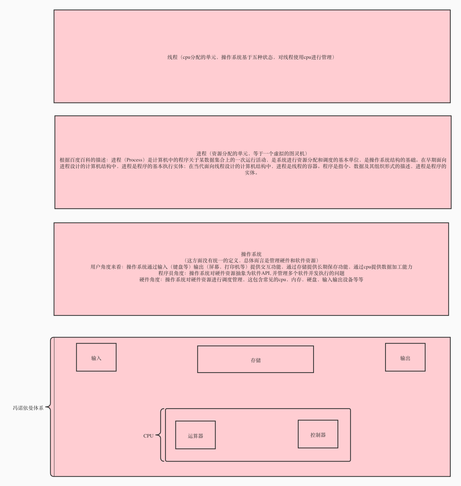

# flutter_counter

关于动画-性能-并发编程

## reference material

* [动](https://flutter.cn/docs/development/ui/animations/tutorial)
* [画](https://www.cnblogs.com/mengqd/p/13034117.html)
* [demo in mobile 20](https://code.connected.bmw/mobile20/mobile-connected/blob/master/feature_modules/notification_center/lib/src/notification_header_cn/notification_animated_dot_cn.dart)

## Animation System Class UML in Flutter

* [refer to http://assets.processon.com/chart_image/60618fea5653bb2225f809d8.png if github can not show correct]

## Performance and Isolate

* [Flutter/Dart中的异步编程之Isolate](https://www.psvmc.cn/article/2020-08-08-flutter-isolate.html)
* [本工程内的展示](./lib/counter/view/counter_view.dart)

## 浅谈并发编程的相关资料

* [Node.js的底层原理](https://zhuanlan.zhihu.com/p/375276722)
* [Flutter 单线程模型](https://dart.cn/articles/archive/event-loop#test-your-understanding)
* [Flutter中Dart异步模型](https://cloud.tencent.com/developer/article/1538048)
* [闲鱼-深入理解Flutter引擎线程模式](https://mp.weixin.qq.com/s/hZ5PUvPpMlEYBAJggGnJsw)
* [JVM线程与操作系统线程](https://blog.csdn.net/CringKong/article/details/79994511)
* [支撑亿级io的底层基石 epoll实战揭秘](https://www.bilibili.com/video/BV1iJ411S7mv/)
* [epoll的水平-电平触发](https://blog.csdn.net/zxm342698145/article/details/80524331)

## 浅谈并发编程

* 首先明确并发和并行的概念：
    * 并发，根据[普林斯顿的课程介绍](https://www.cs.princeton.edu/~dpw/courses/cos326-12/lec/15-parallel-intro.pdf) ,核心是协调多方对共享资源的访问
        * 目的
            * 加快相应时间（防止cpu空载，比如IO，广义的io包含文件，网络，键盘等各种设备）
        * 实现的机制
            * 线程间切换，操作系统层面是中断机制
            * 线程切换的原则就是：当线程可以做一些有用的进展的话，我们就继续这个线程的工作，否则挂起这个线程，然后切换到其他线程工作
    * 并行是同时处理多个任务，目的是提高吞吐量。实现的方式通常是多物理计算核心，甚至多计算机进行同时处理
    * 所以，并行是并发的子集

一切的开始从[冯诺依曼体系结构或者叫普林斯顿结构](https://baike.baidu.com/item/%E5%86%AF%C2%B7%E8%AF%BA%E4%BE%9D%E6%9B%BC%E4%BD%93%E7%B3%BB%E7%BB%93%E6%9E%84/4690854)
开始 * 冯诺依曼体系是我们现在日常接触的体系，相关的图片如下 * 

*

根据百科的说法：冯·诺伊曼体系结构构成的计算机，必须具有如下功能：把需要的程序和数据送至计算机中。必须具有长期记忆程序、数据、中间结果及最终运算结果的能力。能够完成各种算术、逻辑运算和数据传送等数据加工处理的能力。能够根据需要控制程序走向，并能根据指令控制机器的各部件协调操作。能够按照要求将处理结果输出给用户。

* 我个人的理解，百科的说法核心是： * 具有长期记忆程序、数据、中间结果及最终运算结果这四个要素 * 能够完成各种算术、逻辑运算和数据传送等数据加工处理 *
  总结就是：数据的存储，加工这两点。至于更多优化的细节：比如操作系统中的中断，进程切换，多级IO缓存，都没有脱离这个范畴。 * 瓶颈： * 指令和数据放在同一个地方引起的总线带宽（相对于哈弗结构减少了50%） *
  存储和cpu速度差距越来越大，现代计算机典型的各环节时间开销如下： * 
* 现代计算机采用多种手段优化，比如多级寄存器，比如cpu内部分区域存储指令数据和普通数据（可以理解为cpu内部实现为哈弗结构） * 扩展： * 其他的我们不能接触的著名体系，比如哈弗体系：需要至少两个硬盘）
* [为什么电脑还沿用冯·诺伊曼结构而不使用哈佛结构？](https://www.zhihu.com/question/22406681)
* [性能之殇：从冯·诺依曼瓶颈谈起](https://zhuanlan.zhihu.com/p/52721155)

* 一切软件的开端可以从操作系统开始
    * 操作系统定义：
        * 目前看起来操作系统没有公认的定义，因为操作系统本身一直在演变
    * 操作系统调度
        * 进程：资源分配的最小单位
            * 一个进程就是CPU执行的单个任务的过程，是程序在执行过程当中CPU资源分配的最小单位，并且进程都有自己的地址空间，包含了运行态、就绪态、阻塞态、创建态、终止态五个状态。
            * [进程间通信方式](https://cloud.tencent.com/developer/article/1690556)
        * 线程：CPU调度的最小单位
            * 线程是CPU调度的最小单位，它可以和属于同一个进程的其他线程共享这个进程的全部资源
    * 我理解的操作系统在冯诺依曼-进程-线程之间的关系如图：
        * 
    * 总结：任何并发模型设计，无法摆脱操作系统的进程抽象，在现代操作系统上，为了利用多核的优势，我们事实上也基本绕不开线程

* Linux五种网络IO模型
    * 同步阻塞
        * 
            * 属于结合多线程进行并发处理来增强系统吞吐的模型，属于一个线程处理一个连接的典型情况
            * 优点：编程简单，在并发量不高的时候，响应速度很高（因为不像同步非阻塞模型中轮询造成的延迟）
            * 缺点：严重依赖线程，线程是很贵重的资源，所以无法支持高并发，单机并发超过1000通常会造成极高的cpu切换线程开销，从而使得系统不可用
                * 具体原因：线程本身的创建，销毁，切换成本很高
                * 线程的本身内存占用过大，java中线程本身占用接近1M内存，这个在10万并发中，我们可以看到线程引起的OOM
                * 容易造成锯齿状系统负载，当线程梳理高，网络不稳定，触发大量网络请求在短时间内大量返回，会触发大量线程激活造成系统压力很大
    * 同步非阻塞
        * 
            * 同步非阻塞模型，释放请求IO阶段的线程，使得这一阶段线程可以处理别的事情，但是数据读写部分仍然是阻塞的（但这块通常很快）
            * 这个模型本身不怎么使用，只是IO多路复用的基础，应为每个用户线程都是轮询本身是很傻的事情，并且可能造成cpu满载。
    * IO多路复用
        * 
            * 这个模型特点，依赖[select(epoll)机制（函数）](https://www.itqiankun.com/article/select-poll-epoll)
              ，属于把同步阻塞模型中，用户线程轮询的流程转移到内核完成，从而避免频繁内核和用户空间切换开销
            * 把最初的同步阻塞的一个线程对应一个Socket，变成了基于Select（Epoll）可以进行多socket监听，从而减少了阻塞的时间，提高了系统吞吐量
    * 信号驱动
        * 
            * 信号驱动很少用，目前看到的是阿里这里有[一篇文章提及UDP使用](https://developer.aliyun.com/article/46410) 聊到这个
    * 异步非阻塞
        * 
            * 异步非阻塞是最符合硬件的信号中断机制工作模式的,目前公认的最佳实现是[Windows的IOCP模式](https://developer.aliyun.com/article/708589)
            * 然而遗憾的是目前Linux底层并没有真正支持这种设计(使用了epoll实现），这也是[为什么Netty放弃了AIO](https://www.jianshu.com/p/df1d6d8c3f9d)
            * 对比IO多路复用
            * 拓展
                * [关于Linux AIO实现不彻底的争议](https://blog.csdn.net/weixin_45784983/article/details/104016068#:~:text=Not%20faster%20than%20NIO%20%28epoll%29%20on%20unix%20systems,faster%20than%20NIO%20%E5%9C%A8%E4%B8%80%E5%AE%9A%E7%A8%8B%E5%BA%A6%E4%B8%8A%E4%BC%9A%E8%AE%A9%E4%BA%BA%E8%AF%AF%E8%A7%A3%E4%B8%BA%20AIO%20%E6%B2%A1%20NIO%20%E5%BF%AB%E3%80%82)
                  ，下面梳理争议的核心，我也没找到答案
                    * aio预分配内存引起的内存开销
                    * linux对aio实现依赖于epoll，这不是真正的中断机制
                    * linux基于epoll实现对aio，性能没有明显改善
                    * aio是proactor模式，netty是reactor模式，所以netty回避AIO
                    * IO多路复用的空循环cpu满载问题
* 并发设计几种模型
    * 线程并发模型
        * 现代的很多语言均支持多线程编程
    * 协程并发模型
        * 在多种语言中，对协程设计最突出对是go语言，Kotlin的实现同样大量参考了Go语言
        * 协程的基础是线程，所以多线程并发问题在协程中同样存在，但为了利用多核心但优势，我们又无法放弃线程
        * 协程在编译层面，实现了任务调度，从而减少了对于操作系统多线程的依赖，减少了系统线程上下文切换的开销
        * 协程上下文占用很小（GO语言只有4KB),相比线程动辄1M级别的上下文，并且绕开了线程切换的用户态内核态切换，吞吐量可以高很多
        * 既然绕不开IO引起的线程阻塞，[协程如何优化来提高并发量](https://zhuanlan.zhihu.com/p/111346689) ，是IO复用
    * IO多路复用
        * 如上面Linux部分提到的，IO多路复用在IO层面提供了单线程大量并发的可能，这也是Go语言在Unix系统上避免线程阻塞的核心设计
    * 类似Node.js的公开单线程和隐藏线程池
        * node.js众所周知的一点是单线程，其实可以认为是调度线程，真正的阻塞任务仍然是在隐藏的线程池进行，类似设计还有java的vert.x。[参考资料](https://zhuanlan.zhihu.com/p/41683283)
        * 类似的，Dart默认也是单线程的，但是参考[Flutter引擎线程模式的UI Task Runner Thread部分](https://mp.weixin.qq.com/s/hZ5PUvPpMlEYBAJggGnJsw) ,他不是单线程的。在IO Task Runner部分，也提到了线程池。

## 发散问题
* 协程和Rx框架能否结合使用？
* 关于同步异步，阻塞非阻塞概念，我看了很多资料，我觉得没有统一的的定义。目前看到一个很有意思的理解：
  * 同步和异步是指函数返回之时，能不能保证任务完成。
  * 阻塞非阻塞的意思是 函数内部遇到资源繁忙时，线程挂起
  * 从上面两条的角度看，只有同步才区分阻塞和非阻塞（理解为轮询和睡眠），异步只有非阻塞设计。

